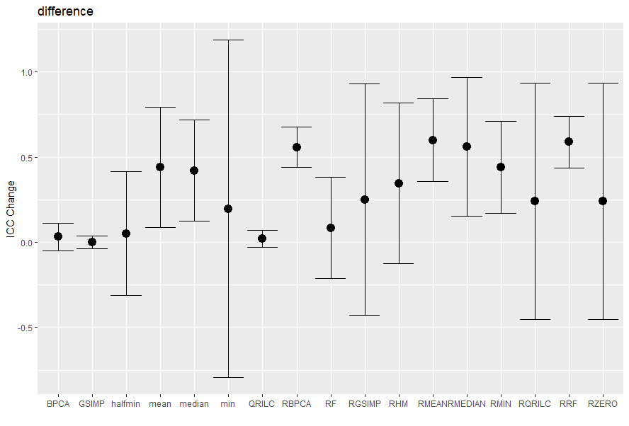
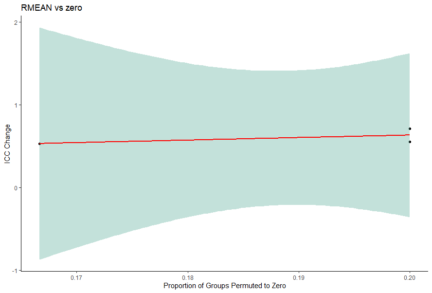

# MetabImpute


## Introduction

```{r setup, eval=FALSE, warning=FALSE,message=FALSE,error=FALSE}

library(MetabImpute)

```

MetabImpute is a package with multiple tools for use in the analysis and imputation of missing data, geared towards 
metabolomics research where replicates (technical or biological) are used. Included in this package are tools to 
evaluate the missingness percentage, min, mean, max, variance and distribution of individual variables, as well as 
attempt to classify the missingness mechanism of variables based on pairwise correlation and goodness of fit testing
approaches. Furthermore, this package includes imputation methodology for various single value imputation approaches such as
Zero, Min, Mean, Median, and Halfmin imputation (which may be specified as a local or global value) as well as several 
widely used imputation methods leveraging complex approaches such as Bayesian PCA, Random Forests, QRILC, and GSImp 
(Wei, R., Wang, J., Jia, E., Chen, T., Ni, Y., & Jia, W. (2017). GSimp: 
      A Gibbs sampler based left-censored missing value imputation approach for metabolomics studies. PLOS Computational Biology). 
We have implemented a new within replicate imputation approach where all values in replicates that have less than 50%
present values are set to zero, and the remaining data after this step is complete is imputed utilizing any of the 
aforementioned imputation methods. We call this imputation Rep<Imputation method> (eg. RepRF for Random Forests). Since
we wanted to implement a package that allows researchers using replicates to evaluate their data, we have included several
functions which evaluate ICC as a measure of replicability, as well as ICC changes after various imputation methods have 
been done. Lastly, we have included methods which simulate data based on covariance matrices, simulate missingness of 
specific types (MCAR, MAR, and MNAR), impute using various methods and then evaluate these imputation approaches using 
NRMSE or PCA-Procrustes analysis. This package is licensed under GNU GPL version 3. Please cite our paper if you use this package or elements contained within it using the following citation: <br/>

(_     ______) <br/>

Special thanks to the following work which was copied, modified and or adapted to aid in the creation of this package: <br/>
https://github.com/Tirgit/missCompare, <br/>
https://github.com/WandeRum/GSimp (Wei, R., Wang, J., Jia, E., Chen, T., Ni, Y., & Jia, W. (2017). GSimp: 
      A Gibbs sampler based left-censored missing value imputation approach for metabolomics studies. PLOS Computational Biology) <br/>
https://github.com/juuussi/impute-metabo Kokla, M., Virtanen, J., Kolehmainen, M. et al. Random forest-based imputation outperforms 
      other methods for imputing LC-MS metabolomics data: a comparative study. BMC Bioinformatics 20, 492 (2019). 
      https://doi.org/10.1186/s12859-019-3110-0
      

```{r, eval=FALSE, warning=FALSE,message=FALSE,error=FALSE}
#Loading example data
data<-read.csv(file='Test_set.csv')
rownames(data)<-data[,1]
data<-data[,-c(1)]
data<-data.frame(lapply(data, function(x) as.numeric(as.character(x))), row.names = rownames(data))
#Number of Replicates 
reps<-5

```

## Variable Statistics and Cullen and Frey Plots

The **variableStatistics** function evaluates variable by variable statistics, missingness percents, distribution estimations and estimations of missingness mechanisms. Input information: <br/>

**data:** the data to be input <br/>
**correlation_method:** the method of correlation used in pairwise correlation, may be 'pearson', 'spearman' or 'kendall' <br/>
**gof_method:** the method of goodness of fit testing with left truncated normal distribution, may be 'kolmogorov' or 'cucconi' <br/>

```{r, eval=FALSE, warning=FALSE,message=FALSE,error=FALSE, results='hide'}
#Variable Statistics Function
var_Stats<-variableStatistics(data=data, 
                              correlation_method = 'spearman', 
                              gof_method = 'kolmogorov')
```
```{r, eval=FALSE}
#Showing first two column of variable statistics 
var_Stats[[1]][,1:2]
```
| X                        | V1                                   | V2        |
|--------------------------|--------------------------------------|-----------|
| Missing Number           | 12                                   | 14        |
| Missing %:               | 40                                   | 46.67     |
| Min:                     | 1                                    | 1         |
| Mean:                    | 2.22                                 | 2.5       |
| Max:                     | 4                                    | 5         |
| Variance:                | 1.59                                 | 1.6       |
| 25th Percentile:         | 1                                    | 2         |
| 50th Percentile:         | 2                                    | 2         |
| 75th Percentile:         | 3                                    | 2.5       |
| Missingness Type:        | MAR                                  | MAR       |
| Distribution (by GAMLSS) | GG                                   | BCT       |
| Distribution Description | generalised Gamma Lopatatsidis-Green | Box-Cox t |

```{r, eval=FALSE}
#Showing missingness proportions 
var_Stats[[2]]
```

| X    | Missingness.Type.By.Variable | Proportion.of.Overall.Missingness |
|------|------------------------------|-----------------------------------|
| MCAR | 0                            | 0                                 |
| MAR  | 75                           | 67.79                             |
| MNAR | 25                           | 32.20                             |
| EX   | 0                            | 0                                 |
| NONE | 0                            | 0                                 |

```{r, eval=FALSE}
#Showing overall missingness
var_Stats[[3]]
```

49.1666667 <br/> <br/>


The **CullenFrey** function plots skewness vs kurtosis with all variables in the data set plotted. 

```{r, eval=FALSE, warning=FALSE,message=FALSE,error=FALSE,results='hide', fig.keep='none'}
CullenFrey(data)
```


## Imputation

Two main functions may be used to impute. The **Impute** function does imputation with a single specified
method, while **imputeMulti** does imputation using multiple included methods and returns a list of imputed matrices. The GSImp method was incorporated and slightly modified to handle the replicate imputation approach defined in our paper from: <br/>

https://github.com/WandeRum/GSimp (Wei, R., Wang, J., Jia, E., Chen, T., Ni, Y., & Jia, W. (2017). GSimp: 
      A Gibbs sampler based left-censored missing value imputation approach for metabolomics studies. PLOS Computational Biology) <br/>
      
Input information: <br/>

**method(s):** in **Impute** this is a string from the following list: 'RF', 'BPCA', 'QRILC', 'GSIMP', 'RHM','RMEAN', 'RMEDIAN', 'RMIN','RZERO', 'RRF', 'RGSIMP', 'RQRILC','RBPCA','min','halfmin', 'mean', 'median', 'zero'. In **imputeMulti** this
is a vector containing a selection of these methods. Any function with R<imputation method> such as RHM or RRF 
indicates that this is a within replicate method that first zeroes out any replicate groups for a variable where
there is less than 50% present values. <br/>
**local:** is a logical indicating if the user would like to use local imputation (if FALSE, this will use 
global imputation). This only applies in single value imputation methods.<br/>
**reps:** is the number of replicates. Note that nrow(data) must be divisible by reps. This package does not handle imbalanced replicate groups.

```{r, eval=FALSE,warning=FALSE,message=FALSE,error=FALSE,results='hide', fig.keep='none'}
imp<-Impute(data=data, method="RF",local=T, reps=5)

impMulti<-imputeMulti(methods=c('RF', 'BPCA', 'QRILC', 'GSIMP', 'RHM','RMEAN', 
                                'RMEDIAN', 'RMIN','RZERO', 'RRF','RGSIMP', 
                                'RQRILC','RBPCA','min','halfmin', 'mean', 
                                'median', 'zero'), 
                      data, 
                      reps = 5)
```

## ICC Evaluation

Since a primary focus of our paper and package is to provide imputation methods that can take biological or 
technical replicates into account. This package includes several functions that can evaluate ICC changes 
between imputed matrices. 

The **iccEval** function returns a list of data frames containing the ICCs for each variable, and difference measures between the imputation methods and the last imputation method included, in the example below this is a comparison of the ICC of each imputation method from 'RF' to 'median' compared with the zero imputed data frame's ICC. The measure is done in 3 ways, average difference in ICC (with 95% CI), average absolute difference (with 95% CI) and average difference of squares (with 95% CI). Only the difference measure will be shown for brevity. Information on inputs: <br/>

**imputed:** is a list of imputed matrices 
```{r, eval=FALSE}
icc<-iccEval(origData=data, 
             reps=5, 
             imputed=impMulti, 
             methods=c('RF', 'BPCA', 'QRILC', 'GSIMP','RHM','RMEAN', 'RMEDIAN', 
                       'RMIN','RZERO', 'RRF','RGSIMP', 'RQRILC','RBPCA','min',
                       'halfmin', 'mean', 'median', 'zero'))
```
```{r, eval=FALSE}
#Showing the first 8 columns
icc$`ICC dataframe`[,1:8]
```

| RF     | BPCA   | QRILC   | GSIMP   | RHM   | RMEAN | RMEDIAN | RMIN  |
|--------|--------|---------|---------|-------|-------|---------|-------|
| 0.597  | 0.586  | -0.153  | 0.00229 | 0.677 | 0.963 | 0.960   | 0.920 |
| 0.187  | 0.0387 | 0.056   | 0.0224  | 0.329 | 0.745 | 0.762   | 0.458 |
| 0.592  | 0.645  | -0.0392 | -0.0432 | 0.425 | 0.938 | 0.938   | 0.931 |
| 0.0795 | 0.203  | 0.134   | 0.151   | 0.319 | 0.665 | 0.535   | 0.475 |
| 0.596  | 0.466  | 0.484   | 0.441   | 1     | 1     | 1       | 1     |
| 0.788  | 0.375  | -0.0927 | -0.0545 | 0     | 0     | 0       | 0     |
| 0.494  | -.338  | -0.173  | -0.0902 | 0.646 | 0.95  | 0.95    | 0.905 |
| 0.412  | 0.028  | -0.0159 | 0.0177  | 0.192 | 0.656 | 0.684   | 0.288 |

```{r, eval=FALSE}
#Showing the first 8 columns. These are mean differences of the indicated imputation method compared with zero imputation
icc$`Difference measure`[,1:8]
```
| X     | RF     | BPCA    | QRILC   | GSIMP    | RHM     | RMEAN | RMEDIAN | RMIN  |
|-------|--------|---------|---------|----------|---------|-------|---------|-------|
| upper | 0.381  | 0.114   | 0.0697  | 0.0375   | 0.817   | 0.842 | 0.968   | 0.708 |
| mean  | 0.0836 | 0.032   | 0.0207  | 0.000874 | 0.345   | 0.599 | 0.562   | 0.44  |
| lower | -0.214 | -0.0498 | -0.0283 | -0.0358  | -0.0126 | 0.356 | 0.155   | 0.172 |

The **ICC_Change_Plot** function plots the mean ICC change with CI of the imputed matrices compared with the zero matrix (in this case)
```{r, eval=FALSE}
#Plotting the difference measure
ICC_Change_Plot(iccMeasure=icc$`Difference measure`, 
                methods=c('RF', 'BPCA', 'QRILC', 'GSIMP', 'RHM','RMEAN', 
                          'RMEDIAN', 'RMIN','RZERO', 'RRF','RGSIMP', 'RQRILC',
                          'RBPCA','min','halfmin', 'mean', 'median', 'zero'), 
                title='difference')

```

The **ICC_Scatter_Plot** function was developed to assist in identifying whether the cause of ICC changes was due to our Replicate imputation approach which permutes an entire replicate to zero if less than 50% of the replicate group have present values.   
```{r, eval=FALSE}
ICC_Scatter_Plot(data = data, 
                 reps=5, 
                 iccImputed = icc$`ICC dataframe`$RMEAN, 
                 iccComparison = icc$`ICC dataframe`$zero, 
                 plotTitle = "RMEAN vs zero")

```



The **ICC_Counts** function counts the number of variables in each ICC class defined by Koo et al's criterion for excellent, good, moderate and poor ICC. (Koo, T. K.; Li, M. Y., A Guideline of Selecting and Reporting Intraclass Correlation Coefficients for Reliability Research. J Chiropr Med 2016, 15 (2), 155-63.)

```{r, eval=FALSE}
counts<-ICC_Counts(icc$`ICC dataframe`)

#Displaying the first 8 columns
counts[,1:8]
```
| X            | RF | BPCA | QRILC | GSIMP | RHM | RMEAN | RMEDIAN | RMIN |
|--------------|----|------|-------|-------|-----|-------|---------|------|
| Excellent    | 0  | 0    | 0     | 0     | 1   | 4     | 4       | 4    |
| Good         | 1  | 0    | 0     | 0     | 0   | 0     | 1       | 0    |
| Moderate     | 3  | 2    | 0     | 0     | 2   | 3     | 2       | 0    |
| Poor         | 4  | 6    | 3     | 5     | 5   | 1     | 1       | 4    |
| Inconclusive | 0  | 0    | 5     | 3     | 0   | 0     | 0       | 0    |

The **ICC_Changes** function counts the number of variables that changed from one ICC class to another based on the same criterion as above after imputation. Input information: <br/>

**iccImputed:** refers to the imputed ICC <br/>
**iccComparison:** refers to the ICC of the baseline data (usually either the original data or the zero imputed matrix)

```{r, eval=FALSE}
changes<-ICC_Change_Counts(iccImputed = icc$`ICC dataframe`$RHM, 
                           iccComparison = icc$`ICC dataframe`$zero)

#Displaying the results
changes
```
| X                         | V1 |
|---------------------------|----|
| Excellent to Good         | 0  |
| Excellent to Moderate     | 0  |
| Excellent to Poor         | 0  |
| Excellent to Inconclusive | 0  |
| Good to Excellent         | 0  |
| Good to Moderate          | 0  |
| Good to Poor              | 0  |
| Good to Inconclusive      | 0  |
| Moderate to Excellent     | 0  |
| Moderate to Good          | 0  |
| Moderate to Poor          | 0  |
| Moderate to Inconclusive  | 0  |
| Poor to Excellent         | 1  |
| Poor to Good              | 0  |
| Poor to Moderate          | 0  |
| Poor to Inconclusive      | 0  |
| Inconclusive to Excellent | 0  |
| Inconclusive to Good      | 0  |
| Inconclusive to Moderate  | 2  |
| Inconclusive to Poor      | 3  |


## Simulation and Evaluation Functions

Lastly, several functions are included from other sources and wrapped into a single simulation function for studying differing imputation method accuracies. The following functions **correlationMatrix**, **simulate**, **simulate_missingness**, **errorEvals** are included in the simulation functions which were adopted from: <br/>
https://github.com/Tirgit/missCompare, <br/>
https://github.com/juuussi/impute-metabo Kokla, M., Virtanen, J., Kolehmainen, M. et al. Random forest-based imputation outperforms 
      other methods for imputing LC-MS metabolomics data: a comparative study. BMC Bioinformatics 20, 492 (2019). 
      https://doi.org/10.1186/s12859-019-3110-0 <br/>
      
Input information: <br/>
**mcar, mar, mnar:** indicate the percentage of missing data to be imposed on the simulated (complete) data set for each of the indicated missingness mechanisms. <br/>
**method:** is a list of error evaluation methods which may be 'NRMSE', 'NRMSE-SOR' (as described in Kokla et al.), 'PCA-P' <br/>
**imputationResults:** is a list of imputed data sets. <br/>
**simulate_Data:** is a logical indicating whether the data is simulated (and thus centered and scaled) or not<br/>

```{r, eval=FALSE}
#correlation matrix
cormat<-correlationMatrix(data)
#Simulated data from missCompare
simulated<-simulate(rownum = 30, 
                    colnum=8, 
                    corMat = cormat[[1]])
#Simulate missingness from impute-metabo
sim_miss<-simulate_missingness(data=simulated, 
                               mcar=0, 
                               mar=0.2, 
                               mnar=0.2)
#imputation using the impute function detailed above
sim_impute<-impute(sim_miss, 
                   method=c('RF'), 
                   reps=5)
#error evaluation functions adopted from impute-metabo
errorEvals(origData=simulated, 
           missData = sim_miss,method=c('NRMSE'), 
           imputationResults = list(sim_impute), 
           simulate_Data = T)
```

The **simulateEngine** function wraps the above methods into a function which induces multiple levels of missingness proportions in multiple different missing mechanism ratios and can evaluate different imputation methods and the two error evaluation methods above. The **rearrangeList** function takes the output of the **simulateEngine** function and rearranges the data in a format that is simpler to plot. Inputs must match **simulateEngine** where indicated. **graphEval** takes the first list element of the output of rearrangeList as an input and creates ggplots for each missingness ratio supplied and for each error evalution method indicated. Finally, **plotResults** takes the output of **simulateEnging** and generates panel ggplots for each missingness condition (for both or one error evaluation method). Input information: <br/>

**simIter:** the number of simulated matrices to create and run (results will be averaged over these)<br/>
**simMissIter:** the number of simulated missing matrices to create for each simulated matrix and for each missingness proportion<br/>
**missMax:** the maximum proportion of missingness<br/>
**missMin:** the minimum proportion of missingness<br/>
**missInc:** the proportion of missingness to increment by<br/>
**missRatios:** the different ratios of missingness by mechanism (should add up to 1) to impose at a given missingness proportion. Every triplet corresponds to a single missingness case. c(MCAR1, MAR1, MNAR1, MCAR2, MAR2, MNAR2, MCAR3...). Eg if we wanted to mix missingness between all three mechanisms as well as run a mix of 50% of MCAR and 50% of MNAR the list would include
c(0.33,0.33, 0.34, 0.5, 0, 0.5). Note that the order of missingness proportions is MCAR, MAR, MNAR. <br/>
**methodsEval:** the list of error evaluations to perform<br/>

```{r, eval=FALSE}
#simulates data, simulates missingness at different percent missingness
sim_engine<-simulateEngine(data=as.data.frame(data), 
                           simIter = 1, 
                           simMissIter = 2, 
                           missMax = 0.4, 
                           missMin = 0.1,
                           missInc = 0.1, 
                           missRatios = c(0,0,1,0,1,0), 
                           methodsImp = c('RF', 'RBPCA','min'), 
                           methodsEval = c('NRMSE', 'PCA-P'),
                           reps=5, 
                           simulate_Data = T)

#rearranges results into a list of DFs that are easier to plot with GGPlot2
results<-rearrangeList(result = sim_engine)

#GGplot2 dataframes are contained in rearrangeList output's first element
graphs<-graphEval(results[[1]])
#panel plot, only first one is produced corresponding to the first missingness ratio inputted. 
grid.arrange(grobs=graphs[[1]], top=names(graphs)[1], ncol=2)

#function to produce ggplots without using the previous two lines of code
plotResults(results=sim_engine)


```


