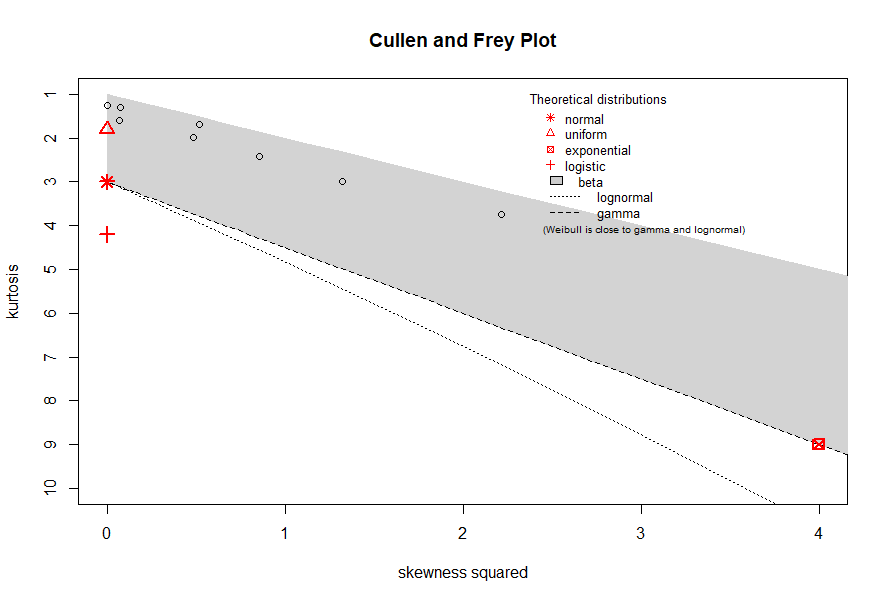

## Introduction

```{r setup, warning=FALSE,message=FALSE,error=FALSE}

library(MetabImpute)

```

MetabImpute is a package with multiple tools for use in the analysis and imputation of missing data, geared towards 
metabolomics research where replicates (technical or biological) are used. Included in this package are tools to 
evaluate the missingness percentage, min, mean, max, variance and distribution of individual variables, as well as 
attempt to classify the missingness mechanism of variables based on pairwise correlation and goodness of fit testing
approaches. Furthermore, this package includes imputation methodology for various single value imputation approaches such as
Zero, Min, Mean, Median, and Halfmin imputation (which may be specified as a local or global value) as well as several 
widely used imputation methods leveraging complex approaches such as Bayesian PCA, Random Forests, QRILC, and GSImp 
(Wei, R., Wang, J., Jia, E., Chen, T., Ni, Y., & Jia, W. (2017). GSimp: 
      A Gibbs sampler based left-censored missing value imputation approach for metabolomics studies. PLOS Computational Biology). 
We have implemented a new within replicate imputation approach where all values in replicates that have less than 50%
present values are set to zero, and the remaining data after this step is complete is imputed utilizing any of the 
aforementioned imputation methods. We call this imputation Rep<Imputation method> (eg. RepRF for Random Forests). Since
we wanted to implement a package that allows researchers using replicates to evaluate their data, we have included several
functions which evaluate ICC as a measure of replicability, as well as ICC changes after various imputation methods have 
been done. Lastly, we have included methods which simulate data based on covariance matrices, simulate missingness of 
specific types (MCAR, MAR, and MNAR), impute using various methods and then evaluate these imputation approaches using 
NRMSE or PCA-Procrustes analysis. This package is licensed under GNU GPL version 3. Please cite our paper (_     ______). 

Special thanks to the following work which was copied, modified and or adapted to aid in the creation of this package: <br/>
https://github.com/Tirgit/missCompare, <br/>
https://github.com/WandeRum/GSimp (Wei, R., Wang, J., Jia, E., Chen, T., Ni, Y., & Jia, W. (2017). GSimp: 
      A Gibbs sampler based left-censored missing value imputation approach for metabolomics studies. PLOS Computational Biology) <br/>
https://github.com/juuussi/impute-metabo Kokla, M., Virtanen, J., Kolehmainen, M. et al. Random forest-based imputation outperforms 
      other methods for imputing LC-MS metabolomics data: a comparative study. BMC Bioinformatics 20, 492 (2019). 
      https://doi.org/10.1186/s12859-019-3110-0
      

```{r, warning=FALSE,message=FALSE,error=FALSE}
#Loading example data
data<-read.csv(file='Test_set.csv')
rownames(data)<-data[,1]
data<-data[,-c(1)]
data<-data.frame(lapply(data, function(x) as.numeric(as.character(x))), row.names = rownames(data))
#Number of Replicates 
reps<-5

```

## Variable Statistics and Cullen and Frey Plots

We include functionality to evaluate variable by variable statistics, missingness percents, distribution estimations and estimations of 
missingness mechanisms. variableStatistics has the following inputs: <br/>

**data:** the data to be input <br/>
**correlation_method:** the method of correlation used in pairwise correlation, may be 'pearson', 'spearman' or 'kendall' <br/>
**gof_method:** the method of goodness of fit testing with left truncated normal distribution, may be 'kolmogorov' or 'cucconi' <br/>

```{r, warning=FALSE,message=FALSE,error=FALSE, results='hide'}
#Variable Statistics Function
var_Stats<-variableStatistics(data=data, correlation_method = 'spearman', gof_method = 'kolmogorov')
```
```{r}
#Showing first two column of variable statistics 
var_Stats[[1]][,1:2]
```
```{r}
#Showing missingness proportions 
var_Stats[[2]]
```
```{r}
#Showing overall missingness
var_Stats[[3]]
```

Cullen and Frey plots may be made with all variables in the dataset plotted. 

```{r, warning=FALSE,message=FALSE,error=FALSE,results='hide', fig.keep='none'}
CullenFrey(data)
```


## Imputation

Two main functions may be used to impute. The *impute* function does imputation with a single specified
method, while *imputeMulti* does imputation using multiple included methods and returns a list of imputed matrices. The following inputs are used: <br/>

**method(s):** in *impute* this is a string from: 'RF', 'BPCA', 'QRILC', 'GSIMP', 'RHM','RMEAN', 'RMEDIAN', 'RMIN','RZERO', 'RRF', 'RGSIMP', 'RQRILC','RBPCA','min','halfmin', 'mean', 'median', 'zero'. In *imputeMulti* this
is a vector containing a selection of these methods. Any function with R<imputation method> such as RHM or RRF 
indicates that this is a within replicate method that first zeroes out any replicate groups for a variable where
there is less than 50% present values. 
**local:** is a logical indicating if the user would like to use local imputation (if FALSE, this will use 
global imputation). This only applies in single value imputation methods.
**reps:** is the number of replicates. Note that nrow(data) must be divisible by reps. This package does not handle imbalanced replicate groups.

```{r, eval=FALSE,warning=FALSE,message=FALSE,error=FALSE,results='hide', fig.keep='none'}
imp<-impute(data=data, method="RF",local=T, reps=5)

impMulti<-imputeMulti(methods=c('RF', 'BPCA', 'QRILC', 'GSIMP', 'RHM','RMEAN', 'RMEDIAN', 'RMIN','RZERO', 'RRF',
                        'RGSIMP', 'RQRILC','RBPCA','min','halfmin', 'mean', 'median', 'zero'), data, reps = 5)
```

## ICC Evaluation

Since a primary focus of our paper and package is to provide imputation methods that can take biological or 
technical replicates into account. This package includes several functions that can evaluate ICC changes 
between imputed matrices. 

```{r, eval=FALSE}
icc<-iccEval(origData=data, reps=5, imputed=impMulti, methods=c('RF', 'BPCA', 'QRILC', 'GSIMP', 'RHM','RMEAN', 'RMEDIAN', 'RMIN','RZERO', 'RRF','RGSIMP', 'RQRILC','RBPCA','min','halfmin', 'mean', 'median', 'zero'))
```
